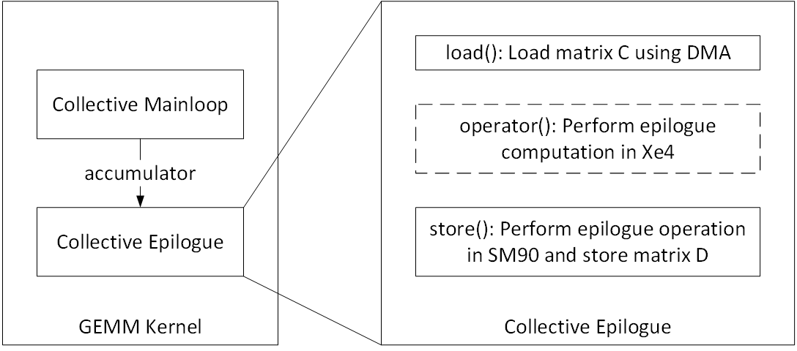
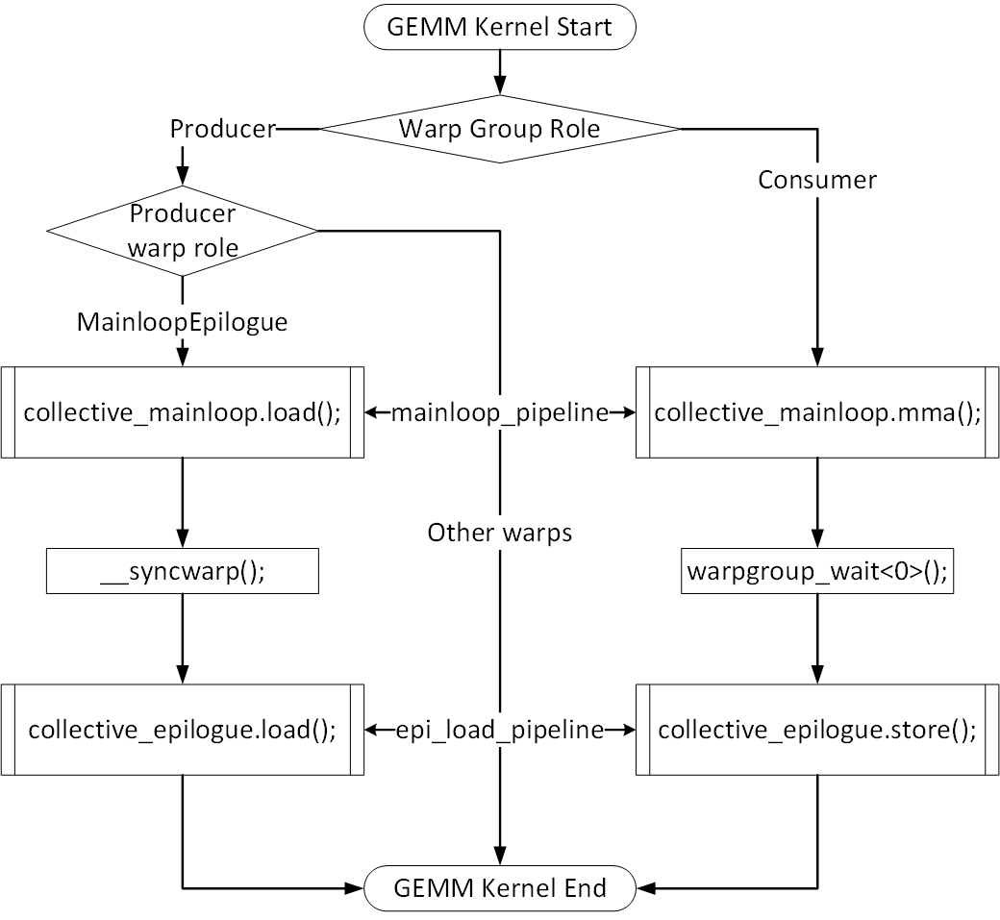
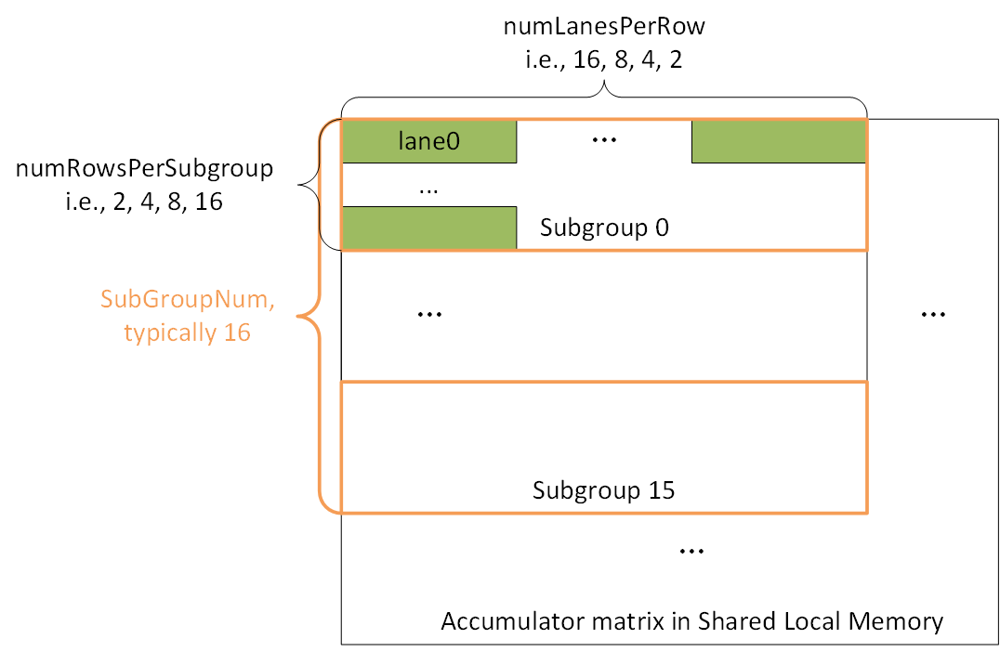

# Xe4 Warp Specialized Epilogue

## Mainloop and Epilogue in GEMM Kernel



## Warp Specialization GEMM Kernel

The following description is based on [sm90_gemm_tma_warpspecialized.hpp](../../../../include/cutlass/gemm/kernel/sm90_gemm_tma_warpspecialized.hpp).

The following picture displays flow chart of a warp specialization GEMM kernel. Warps are divided into warp groups which containing 4 warps. In the following example, there are totally 8 warps thus 2 warp groups, one is producer responsible for loading matrix from global memory, the other is consumer responsible for computing and storing matrix back to global memory.



Producer and consumer are determined by the following code snippet, meaning that warp 0~3 are producers and 4~7 are consumers. However, among producers there is only one warp works.

```cpp
int thread_idx = int(threadIdx.x); // [0, 256)
int lane_idx = canonical_lane_idx(); // [0, 32)
int warp_idx = canonical_warp_idx_sync(); // [0, 8)
int warp_idx_in_warp_group = warp_idx % NumWarpsPerWarpGroup; // [0, 4)
int warp_group_thread_idx = thread_idx % NumThreadsPerWarpGroup; // [0, 128)
auto warp_group_role = WarpGroupRole(canonical_warp_group_idx()); // [0, 2)
auto producer_warp_role = ProducerWarpRole(warp_idx_in_warp_group);
```

Mainloop and epilogue are separated by `__syncwarp()` [line 392 of sm90_gemm_tma_warpspecialized.hpp](../../../../include/cutlass/gemm/kernel/sm90_gemm_tma_warpspecialized.hpp) and `warpgroup_wait<0>()` [line 574 of sm90_mma_tma_gmma_ss_warpspecialized.hpp](../../../../include/cutlass/gemm/collective/sm90_mma_tma_gmma_ss_warpspecialized.hpp).

## Epilogue Access

In CUTLASS, epilogue performs data computation and store in a single method `store()`, while in Xe4, we use another overloaded function `operator()` to do epilogue computation.

### Pattern 2 based Access

We defined a basic thread value layout and then repeat across each dimension to cover the whole accumulator matrix in shared local memory, this is done by `make_tiled_copy()` in [xe4_detail.hpp](../../../../include/cutlass/epilogue/thread/xe4_detail.hpp).


